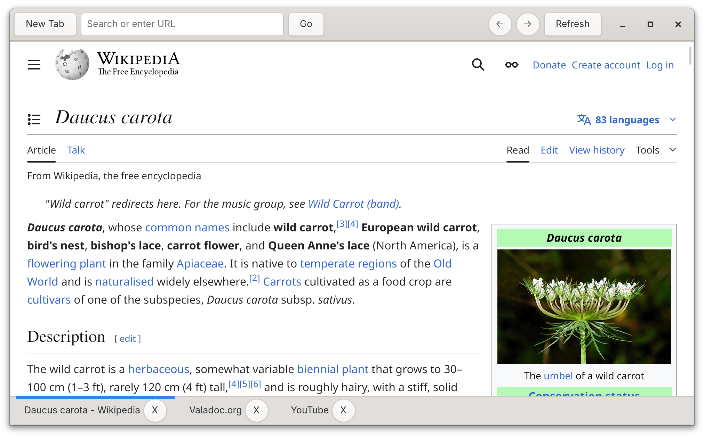

# Platinum



A WebKitGTK-based browser written in Vala.

## Resources

Eventually you'll be able to create your own themes and plugins using CSS and Lua. Here you'll be able to find documentation for that.

## Compiling

Requires `gtk4`, `valac`, `libgee`, `glib-networking`, and `meson`.

```
meson build
cd build
meson compile
./platinum-gtk
```

## Project Goals

1. **Accessibility** - Not only should everything work with a screen reader, it should be simple to use and understand for everyone.
2. **Customizability** - Everyone has different preferences. A user should be able to apply that to their browser. 
3. **Community** - Create a wide and open community to help maintain the project. An accepting and inclusive community is part of this--no fascism.


