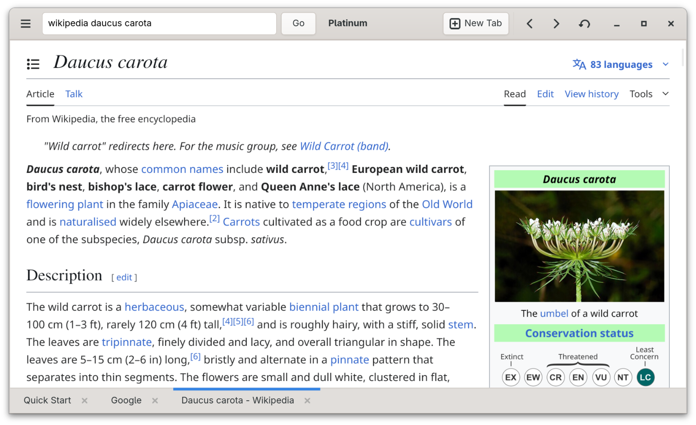

# Platinum



A WebKitGTK-based browser written in Vala.

[](https://github.com/redstone-dev/platinum-gtk/actions/workflows/main.yml)


## Compiling

Requires `gtk4`, `valac`, `libgee`, `glib-networking`, `json-glib`, and `meson`. For Ubuntu, run `sudo apt install libgee-0.8-2 libgee-0.8-dev cmake libwebkitgtk-6.0-dev libgtk-4-dev valac libgee-0.8-2 glib-networking json-glib-tools meson` to obtain the required dependencies.

```
meson build
cd build
meson compile
./platinum-gtk
```

## Project Goals

1. **Accessibility** - Not only should everything work with a screen reader, it should be simple to use and understand for everyone.
2. **Customizability** - Everyone has different preferences. A user should be able to apply that to their browser. 
3. **Community** - Create a wide and open community to help maintain the project. An accepting and inclusive community is part of this--no fascism.
